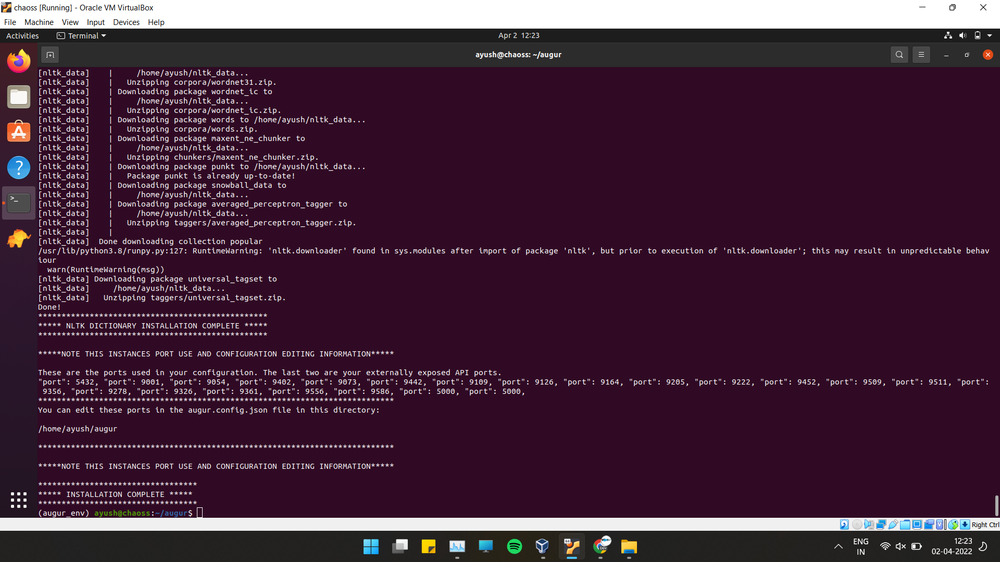
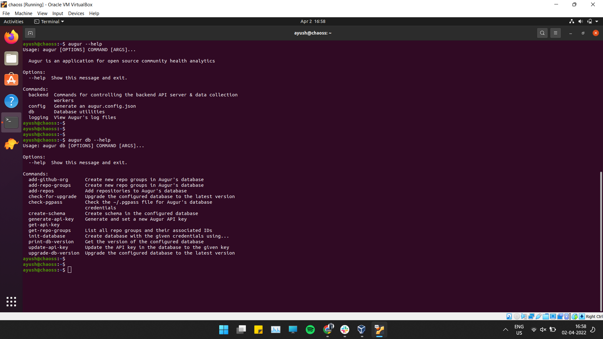

# Chaoss-Gsoc-Application

## Microtask 0
Achieved successful installation of augur in an Ubuntu 20.04 Virtual Machine.

## Microtask 2
Issues during installation:
1. Since I was working on the virtual machine, so firstly the disk space got insufficient and I had to increase it by creating new partitions and formatting it.
2. Secondly, after getting through most steps of the installation I got a network adaptor error- The VM had lost access to the internet and also lost the bridge connectivity to the host system.
3. There was a tensorflow conflict in between, which was impossible to deal with- I uninstalled tensorflow and re-executed the makefile for the installation, created a totally new python environment, changed the installation directory as well as environment, but all in vain. I had to relaunch a fresh, new Virtual Machine to resolve it.
4. Then the most difficult issue was the creation of the schemas. The error was not clear and I spent many days looking for SQLalchemy programming errors, DBAPI errors, and so many more, but actually the schemas were not created during the execution of the Makefile. So, I had to manually create the schemas using `augur db create-schemas` (got help from @sean, here)

